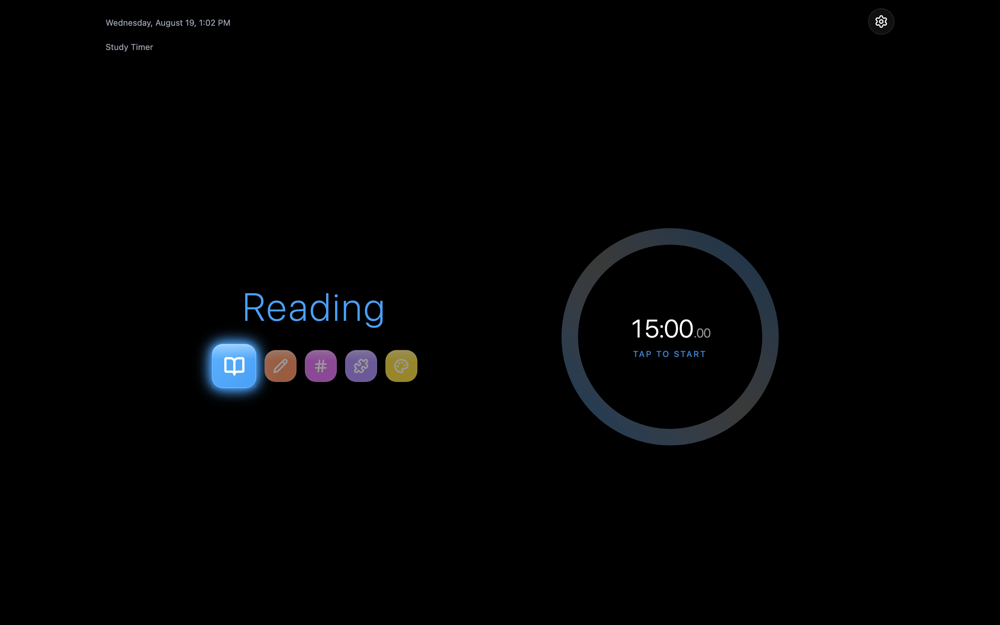
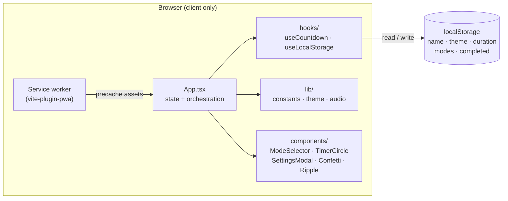
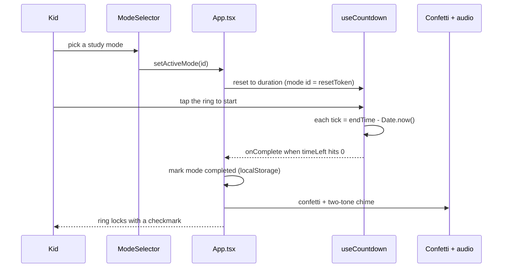

# Study Timer

A calm, responsive study timer for kids. Pick a study mode, run the circular
countdown, and watch it lock with a checkmark and a burst of confetti once the
session is complete. No accounts, no backend - everything runs in the browser
and remembers itself between visits.



[](LICENSE)


## Contents

- [Features](#features)
- [Architecture](#architecture)
- [How a session runs](#how-a-session-runs)
- [Design decisions and trade-offs](#design-decisions-and-trade-offs)
- [Tech stack](#tech-stack)
- [Quick start](#quick-start)
- [Configuration](#configuration)
- [Project layout](#project-layout)
- [License](#license)

## Features

- Seven study modes - Reading, Writing, Math, Puzzle, Art, Music, and Game - each with its own color and Lucide icon. Music and Game start hidden; toggle them on in Settings.
- Flat-glass mode selector - a row of frosted-glass icon buttons with the active one enlarged and glowing.
- Wall-clock-anchored countdown that stays accurate across background-tab throttling and re-syncs the moment you return to the tab.
- Session locking - a mode locks with a checkmark once its session completes and cannot be re-run until the duration changes or sessions are reset.
- Celebration effects - confetti and a two-tone WebAudio chime on completion, both skipped when the OS requests reduced motion.
- Dark and light themes, toggled from Settings and remembered between visits.
- Configurable session length - 5s (test), 1 minute, 5 minutes, or 15 minutes.
- Editable name shown in the header, set at build time or edited live in Settings.
- Installable PWA that works fully offline after the first load.
- Fully responsive from iPhone SE to iPad Pro, with a custom `lg-land` breakpoint that switches from a stacked to a side-by-side layout - and no page scrolling in any size.
- Persistent by default - name, theme, duration, enabled modes, and completed sessions all live in `localStorage` and restore on load.

## Architecture

Study Timer is a single client-side React app - there is no server, no database,
and no network calls after the assets load. `App.tsx` owns all state through a
set of `localStorage`-backed hooks and composes a handful of presentational
components. A service worker (vite-plugin-pwa) precaches the build so the app
keeps working offline.



One direction of flow, three layers:

| Layer | Files | Role |
|-------|-------|------|
| Shell | `App.tsx`, `main.tsx` | Holds all state, wires hooks to components, formats the header clock |
| Hooks | `hooks/useCountdown.ts`, `hooks/useLocalStorage.ts` | Wall-clock countdown engine; persistent state primitive |
| Lib | `lib/constants.ts`, `lib/theme.ts`, `lib/audio.ts` | Modes + storage keys; glassmorphism styles; WebAudio chime |
| UI | `components/*` | Mode selector, timer ring, settings modal, confetti, ripple layer |
| State | `localStorage` | Name, theme, duration, enabled modes, completed sessions |

The countdown never trusts a raw `setInterval` tick count. Each tick recomputes
`timeLeft` from `endTime - Date.now()` and re-syncs on `visibilitychange`, so a
throttled or backgrounded tab still shows the true remaining time.

## How a session runs



## Design decisions and trade-offs

Study Timer optimizes for one thing: a distraction-free timer a young kid can run
alone on a tablet, that survives a refresh and a dead network. Every choice below
follows from that.

| Decision | Chosen | Alternative | Why this trade-off | Cost we accept |
|----------|--------|-------------|--------------------|----------------|
| Persistence | `localStorage` | Backend + accounts | Zero setup, instant, private to the device | State is per-device; nothing syncs across devices |
| Countdown | Wall-clock (`Date.now()`) | `setInterval` tick count | Accurate under background-tab throttling; re-syncs on focus | Needs a `visibilitychange` re-sync path |
| Backend | None (static SPA) | API server | Nothing to run or secure; deploys anywhere as static files | No shared state, no server-side features |
| Offline | Service worker precache | Online-only | Works on a tablet with no wifi after first load | Must ship and version a service worker |
| Sound | WebAudio, one shared context | Bundled audio files | No asset to load; a single reused `AudioContext` avoids the browser context cap | Synthesized tone, not a recorded sample |
| Styling | Tailwind + inline dynamic styles | CSS modules | Fast to build; per-mode colors set at runtime | Some inline `style` for dynamic color values |
| Motion | Respects `prefers-reduced-motion` | Always animate | Confetti is skipped for users who ask for less motion | A branch on every celebration |

## Tech stack

- React 19 + TypeScript (strict) - UI and state
- Vite 7 - dev server and build
- Tailwind CSS v3 - styling
- vite-plugin-pwa (Workbox) - installable, offline-ready PWA
- Lucide React - icons
- Web Audio API - completion chime
- Vitest + React Testing Library - unit and component tests
- localStorage - persistence

## Quick start

```bash
git clone https://github.com/bunlongheng/study-timer.git
cd study-timer
npm install
npm run dev
```

The dev server runs at http://localhost:3019. Build a production bundle with
`npm run build` and preview it with `npm run preview`.

| Script | What it does |
|--------|--------------|
| `npm run dev` | Start the Vite dev server on port 3019 |
| `npm run build` | Type-check, then build the production bundle |
| `npm run preview` | Serve the production build locally |
| `npm run lint` | Run ESLint |
| `npm test` | Run the Vitest suite once |
| `npm run test:watch` | Run Vitest in watch mode |

## Configuration

No environment variables are required. One optional build-time variable sets the
default name shown in the header (a kid can always change it live in Settings):

| Env var | Default | Purpose |
|---------|---------|---------|
| `VITE_USER_NAME` | `Norden Heng` | Default header name baked into the build; overridden by any name saved in Settings |

## Project layout

```
study-timer/
├── index.html               # App shell + PWA meta
├── public/
│   ├── favicon.ico
│   └── icons/               # PWA / apple-touch icons
├── src/
│   ├── App.tsx              # State + orchestration
│   ├── main.tsx             # React entry
│   ├── index.css            # Tailwind layers + custom styles
│   ├── components/
│   │   ├── ModeSelector.tsx     # Frosted-glass mode buttons
│   │   ├── TimerCircle.tsx      # SVG progress ring
│   │   ├── MillisecondDisplay.tsx
│   │   ├── SettingsModal.tsx    # Theme, duration, name, modes, reset
│   │   ├── Confetti.tsx         # Completion confetti
│   │   ├── RippleLayer.tsx      # Tap ripples
│   │   └── ToggleSwitch.tsx
│   ├── hooks/
│   │   ├── useCountdown.ts      # Wall-clock countdown engine
│   │   └── useLocalStorage.ts   # Persistent state primitive
│   └── lib/
│       ├── constants.ts         # Modes, storage keys, defaults
│       ├── theme.ts             # Glassmorphism styles
│       └── audio.ts             # WebAudio completion chime
├── docs/screenshots/        # README images
├── vite.config.js           # Vite + PWA config
└── vercel.json
```

## License

[MIT](LICENSE) (c) Bunlong Heng
